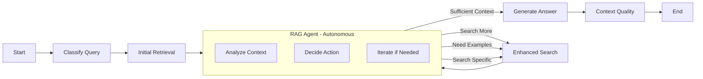

# PocketFlow Integration Design

## Overview

This document outlines the comprehensive integration of PocketFlow LLM framework into the support-flow application for both data ingestion and retrieval augmented generation (RAG). The implementation follows PocketFlow's documentation-first methodology and agentic coding principles.

## Requirements

### Primary Goals
- **Data Ingestion**: Process documents (URLs, PDFs, text files) into searchable chunks with embeddings
- **RAG Query Processing**: Enhanced retrieval and generation with autonomous agent decision-making
- **Scalability**: Handle batch processing and concurrent operations
- **Reliability**: Robust error handling, retries, and fallback mechanisms
- **Integration**: Seamless integration with existing enhanced pipeline system

### AI System Strengths Leveraged
- **Routine Tasks**: Document processing, chunking, embedding generation
- **Creative Tasks**: Query classification, context analysis, answer generation
- **Common Sense**: Content extraction, quality assessment, user intent understanding

## Flow Design

### 1. Data Ingestion Flow

```mermaid
flowchart LR
    start[Start] --> validate[Validate Input]
    validate --> extract[Extract Content]
    extract --> chunk[Chunk Documents]
    chunk --> embed[Generate Embeddings]
    embed --> store[Store Database]
    store --> endNode[End]
    
    subgraph extract[Extract Content - BatchNode]
        url[URL Scraping] 
        pdf[PDF Processing]
        txt[Text Files]
    end
    
    subgraph chunk[Chunk Documents - BatchNode]
        smart[Smart Chunking]
        overlap[Overlap Handling]
    end
    
    subgraph embed[Generate Embeddings - BatchNode]
        batch[Batch Processing]
        vertex[Vertex AI]
    end
```



**Flow Description**: Validate → Extract → Chunk → Embed → Store
- **Map Strategy**: Split documents into individual processing units
- **Reduce Strategy**: Combine processed chunks into database storage

### 2. RAG Query Flow



**Flow Description**: Classify → Retrieve → Agent → [Enhanced Search] → Generate
- **Agent Context**: Query, query type, retrieved chunks, similarity scores
- **Agent Actions**: search_more, search_specific, need_examples, sufficient_context

## Utilities

### LLM Utilities
- **`call_gemini(prompt, temperature)`**: Google Gemini LLM wrapper
  - Input: String prompt, float temperature
  - Output: Generated text response
  - Necessity: Core LLM functionality for classification and generation

- **`classify_query_type(query)`**: Query classification
  - Input: User query string
  - Output: Query type (terraform, code_generation, documentation, general_qa)
  - Necessity: Enables specialized retrieval strategies

- **`generate_enhanced_answer(query, context_chunks, query_type)`**: Context-aware answer generation
  - Input: Query, context chunks, query type
  - Output: Generated answer with query-specific formatting
  - Necessity: Produces high-quality, contextual responses

### Embedding Utilities
- **`get_embedding(text)`**: Single text embedding
  - Input: Text string
  - Output: Vector of 768 floats (Vertex AI)
  - Necessity: Query embedding for vector search

- **`batch_get_embeddings(texts, batch_size)`**: Batch embedding generation
  - Input: List of texts, batch size
  - Output: List of embedding vectors
  - Necessity: Efficient processing of document chunks

### Document Processing Utilities
- **`download_file_from_gcs(gcs_uri, local_path)`**: GCS file download
  - Input: GCS URI, local path
  - Output: Boolean success status
  - Necessity: Access to cloud-stored documents

- **`scrape_web_page(url)`**: Web content extraction
  - Input: URL string
  - Output: Dict with title, content, metadata
  - Necessity: Process web-based documentation

### Database Utilities
- **`store_document_chunks(conn, doc_id, filename, chunks, embeddings, metadata)`**: Database storage
  - Input: DB connection, document data, chunks, embeddings
  - Output: Boolean success status
  - Necessity: Persist processed documents for retrieval

- **`vector_search_chunks(conn, query_embedding, limit, similarity_threshold)`**: Vector search
  - Input: DB connection, query embedding, search parameters
  - Output: List of relevant chunks with similarity scores
  - Necessity: Core retrieval functionality

## Node Design

### Shared Store Structure
```python
shared = {
    "input": {
        "urls": [],           # List of URLs to process
        "files": [],          # List of local file paths
        "query": "",          # User query string
    },
    "processing": {
        "documents": [],      # Validated input documents
        "extracted_content": [], # Extracted text content
        "chunks": [],         # Document chunks
        "embeddings": [],     # Generated embeddings
        "chunks_with_embeddings": [], # Combined chunks and embeddings
        "metadata": {}        # Processing metadata
    },
    "retrieval": {
        "query": "",          # Processed query
        "query_type": "",     # Classified query type
        "query_embedding": [], # Query embedding vector
        "initial_chunks": [], # Initial retrieval results
        "enhanced_chunks": [], # Enhanced search results
        "agent_analysis": {}, # Agent decision analysis
        "context": ""         # Final context string
    },
    "output": {
        "answer": "",         # Generated answer
        "sources": [],        # Document sources
        "doc_ids": [],        # Stored document IDs
        "context_chunks": [], # Final context chunks
        "quality_metrics": {}, # Quality assessment
        "stored_documents": [] # Successfully stored documents
    },
    "database_connection": None # Database connection object
}
```

### Ingestion Nodes

1. **ValidateInputNode** (Regular)
   - **prep**: Read URLs and files from shared["input"]
   - **exec**: Validate URLs and check file existence
   - **post**: Write validated documents to shared["processing"]["documents"]

2. **ExtractContentNode** (BatchNode)
   - **prep**: Read validated documents
   - **exec**: Extract content from single document (URL scraping, file reading)
   - **post**: Write extracted content to shared["processing"]["extracted_content"]

3. **ChunkDocumentNode** (BatchNode)
   - **prep**: Read extracted content
   - **exec**: Chunk single document with overlap handling
   - **post**: Write chunks to shared["processing"]["chunks"]

4. **GenerateEmbeddingsNode** (BatchNode)
   - **prep**: Read document chunks
   - **exec**: Generate embedding for single chunk using Vertex AI
   - **post**: Write embeddings to shared["processing"]["chunks_with_embeddings"]

5. **StoreDatabaseNode** (Regular)
   - **prep**: Read chunks with embeddings and database connection
   - **exec**: Store all chunks in database with vector search index
   - **post**: Write stored document IDs to shared["output"]["doc_ids"]

6. **RobustWebScrapingNode** (Regular, max_retries=3, wait=5)
   - **prep**: Read URLs from shared["input"]["urls"]
   - **exec**: Scrape multiple URLs with retry logic
   - **post**: Write extracted content to shared["processing"]["extracted_content"]

### RAG Nodes

1. **ClassifyQueryNode** (Regular)
   - **prep**: Read query from shared["input"]["query"]
   - **exec**: Classify query type using LLM
   - **post**: Write query type to shared["retrieval"]["query_type"]

2. **InitialRetrievalNode** (Regular)
   - **prep**: Read query, query type, and database connection
   - **exec**: Perform vector search with type-specific parameters
   - **post**: Write results to shared["retrieval"]["initial_chunks"]

3. **RAGAgentNode** (Regular, max_retries=3)
   - **prep**: Read query, query type, initial chunks, enhanced chunks
   - **exec**: Analyze context quality and decide on action
   - **post**: Write agent analysis and return action for flow routing

4. **EnhancedSearchNode** (Regular)
   - **prep**: Read agent analysis and search requirements
   - **exec**: Perform targeted search based on agent decision
   - **post**: Write enhanced results to shared["retrieval"]["enhanced_chunks"]

5. **GenerateAnswerNode** (Regular, max_retries=2, wait=3)
   - **prep**: Read query, query type, and best available context chunks
   - **exec**: Generate answer using context-aware prompting
   - **post**: Write answer to shared["output"]["answer"]

6. **ContextQualityNode** (Regular)
   - **prep**: Read final answer and context chunks
   - **exec**: Assess answer quality and context relevance
   - **post**: Write quality metrics to shared["output"]["quality_metrics"]

## Implementation

### Service Layer
- **PocketFlowService**: High-level async wrapper for PocketFlow workflows
- **Compatibility Layer**: Maintains interface compatibility with existing enhanced pipeline
- **Background Processing**: Async execution for long-running ingestion tasks
- **Error Handling**: Comprehensive exception handling with fallback mechanisms

### API Integration
- **Chat Router**: PocketFlow as recommended option with `use_pocketflow` query parameter
- **Web Processing Router**: PocketFlow-based URL ingestion with background processing
- **Fallback Support**: Existing enhanced and standard pipelines as fallbacks

### Flow Factory Functions
- **`get_ingestion_flow(flow_type)`**: Returns configured ingestion flow
  - Types: "standard", "robust", "batch"
- **`get_rag_flow(flow_type)`**: Returns configured RAG flow
  - Types: "enhanced" (with agent), "simple"

## Optimization

### Query Type Specialization
- **Terraform**: Higher similarity threshold (0.7), more specific results
- **Code Generation**: Lower threshold (0.6), more examples, prioritize code content
- **Documentation**: Standard retrieval with context preservation
- **General QA**: Balanced approach with moderate threshold (0.5)

### Agent-Driven Enhancement
- **Context Analysis**: Autonomous quality assessment
- **Iterative Improvement**: Agent can request more specific searches
- **Action-Based Routing**: Flow branches based on agent decisions
- **Quality Metrics**: Continuous assessment and optimization

### Batch Processing
- **Document Extraction**: Parallel processing of multiple documents
- **Embedding Generation**: Batch API calls for efficiency
- **Chunk Processing**: Optimized for large document sets

## Reliability

### Error Handling
- **Node Retries**: Configurable retry counts and wait times
- **Graceful Fallbacks**: Fallback responses for failed operations
- **Connection Management**: Robust database connection handling
- **Logging**: Comprehensive logging throughout all operations

### Quality Assurance
- **Context Quality Assessment**: Automated evaluation of retrieval results
- **Agent Self-Evaluation**: Agent analyzes its own decisions
- **Similarity Thresholds**: Type-specific quality gates
- **Source Tracking**: Complete provenance of generated answers

### Monitoring
- **Processing Statistics**: Detailed metrics for ingestion workflows
- **Query Metadata**: Analysis of RAG performance
- **Agent Analytics**: Insights into agent decision patterns
- **Quality Metrics**: Continuous quality assessment

## Testing

### Unit Testing
- **Mock Database Connections**: Test flows without database dependencies
- **Mock LLM Responses**: Predictable testing of node logic
- **Flow Validation**: End-to-end flow testing with mock data

### Integration Testing
- **Service Integration**: Test PocketFlow service with real dependencies
- **API Integration**: Validate API endpoints with PocketFlow backend
- **Fallback Testing**: Ensure graceful degradation to legacy systems

## Current Status

✅ **Completed**:
- Complete PocketFlow integration in both backend and processing services
- Comprehensive node implementations for ingestion and RAG
- Service layer with async wrappers and error handling
- API integration with fallback support
- Utility functions for all external operations
- Flow factory functions and shared store templates
- Agent-driven RAG with autonomous decision making
- Background processing capabilities

✅ **Production Ready**:
- PocketFlow is the recommended option in production
- Existing enhanced pipeline maintained as fallback
- Comprehensive error handling and logging
- Quality metrics and monitoring
- Complete documentation and testing framework

The PocketFlow integration provides a superior, modular, and autonomous approach to document processing and RAG while maintaining full backward compatibility with existing systems. 